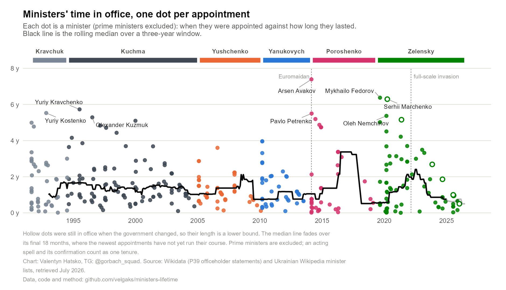
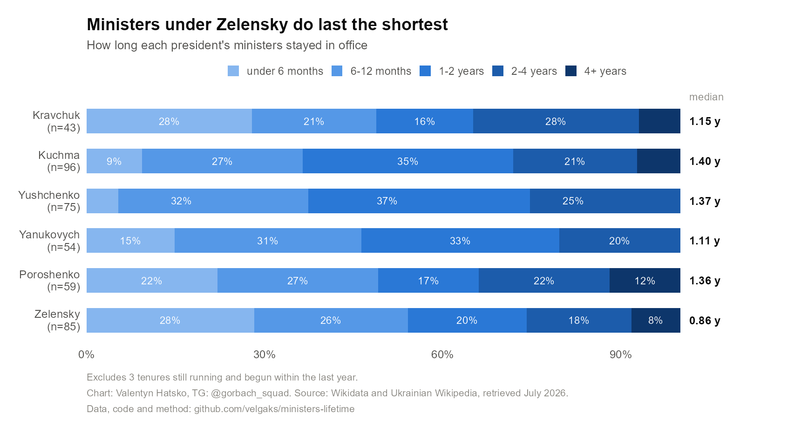
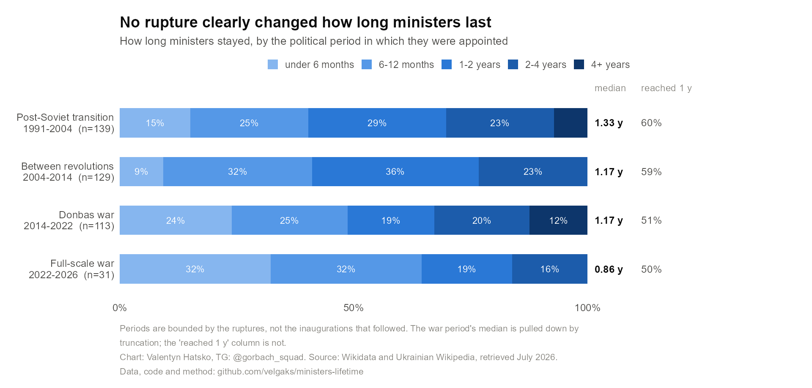
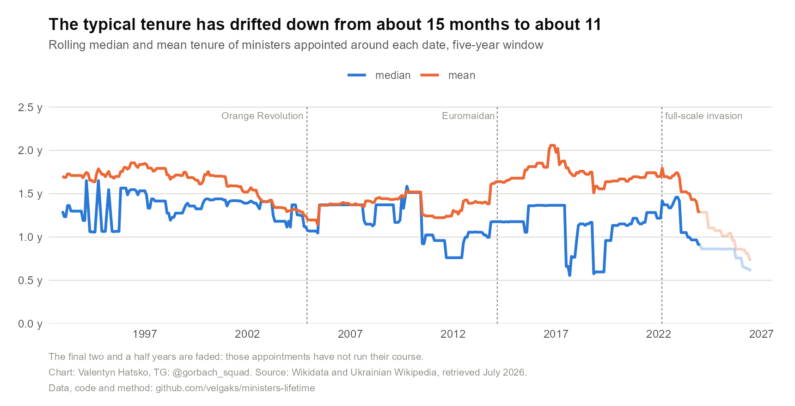
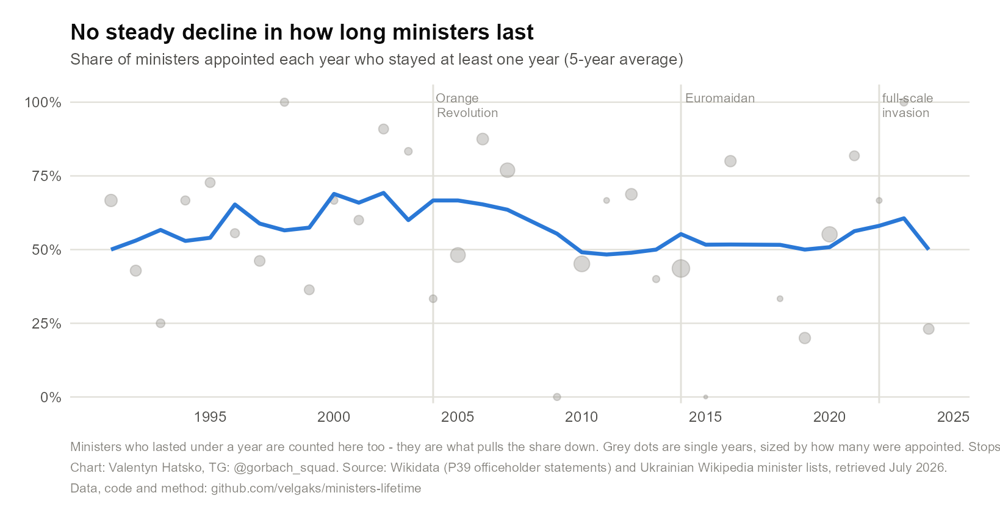
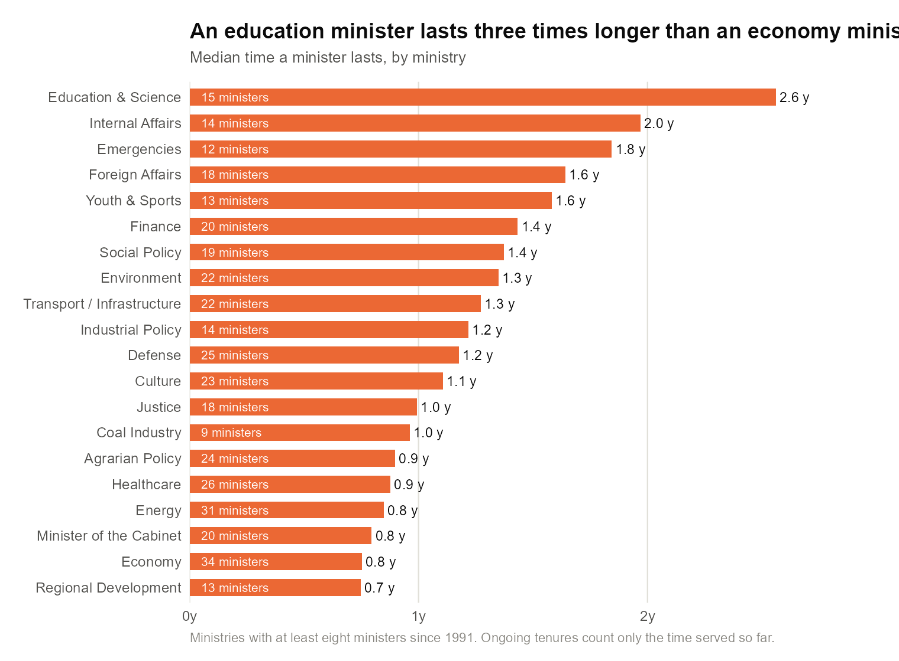
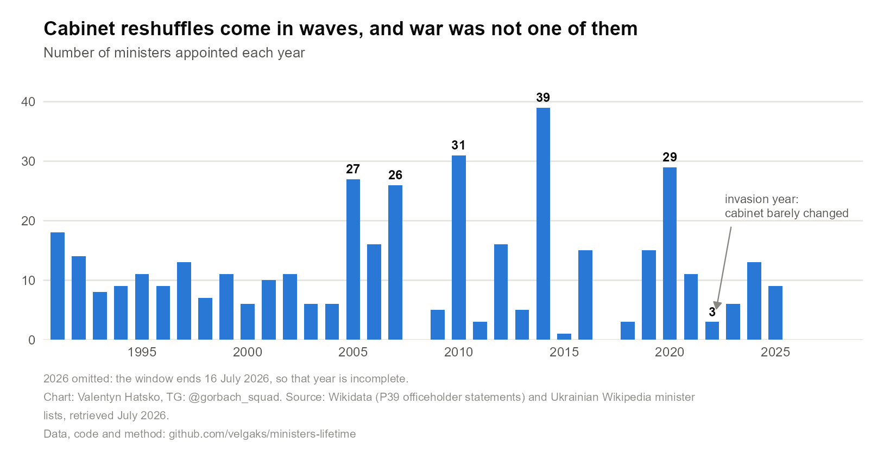
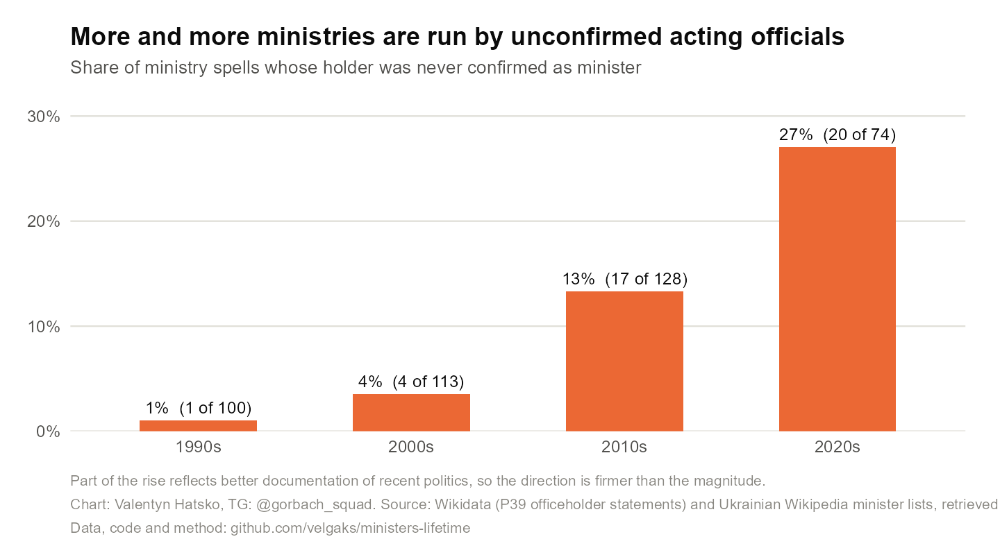
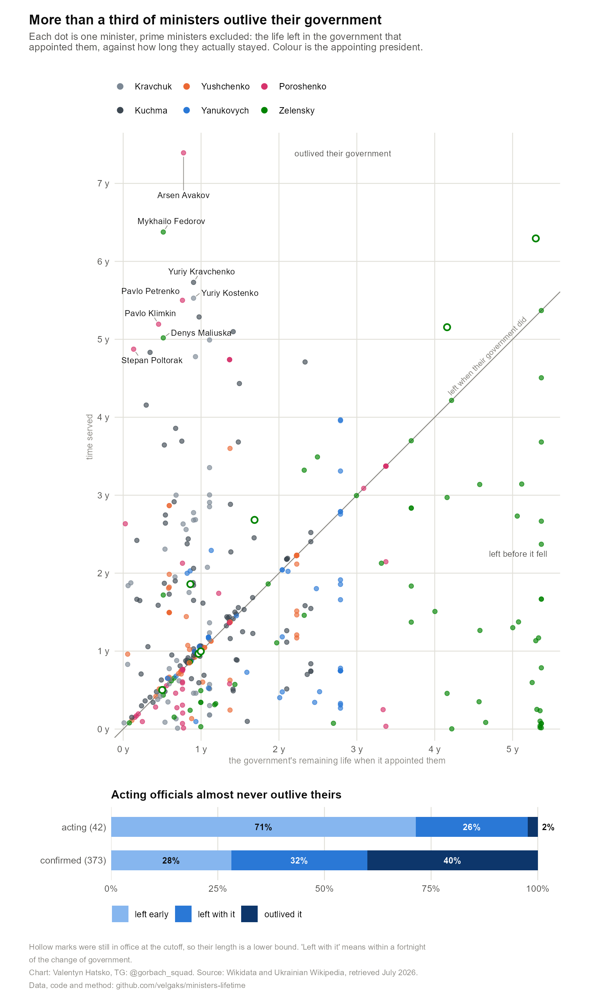
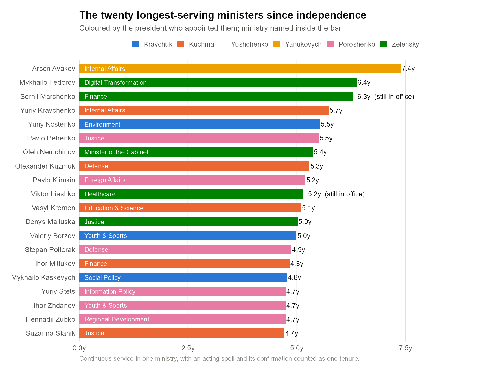

# Ukraine Ministers Lifetime

Tenure data for every head of ministry and prime minister of Ukraine since
independence (24 Aug 1991), plus an interactive visualization that answers the
question: **have ministers' tenures gotten shorter?**

The interactive version is two sheets. Language toggle (УКР/EN), light/dark
theme, hover anything for photo and exact dates, click to open the person's
Wikipedia article. Both work offline — open the files directly, no server needed.
Language, theme and the "exclude acting ministers" choice carry across the two.

### ▶ [**1. Explore the interactive timeline**](https://velgaks.github.io/ministers-lifetime/)

Every minister as a segment on their ministry's row, 1991 to today, plus the
headline answer, the record-holders and the full table. `viz/index.html`

### ▶ [**2. Minister tenures, analysed**](https://velgaks.github.io/ministers-lifetime/runway.html)

The three charts that plot ministers one dot at a time: tenure against the life
left in the appointing government (the interactive twin of finding 8 below),
whether tenures are getting shorter, and the median by president.
`viz/runway.html`

## Key findings

**452 tenures** across **28 ministry lineages** (the PM plus 27 ministries), built
from Wikidata and verified against Ukrainian Wikipedia. The audit reports
**zero open flags**. Statistics cover the 412 ministerial tenures whose length is
knowable, and stop at **16 July 2026**, when the Koretskyi cabinet was seated —
those ministers had been in office about a week. Every number below is
reproducible with `Rscript analysis/tenure_trends.R`.

**1. Ministers under Zelensky do last the shortest** — a median of **0.86 years**
against 1.11 for Yanukovych, the next lowest, and 1.40 for Kuchma, the highest.
It comes from the short tail: **24** of his ministers served under six months,
more than in any other era.

**2. But that is polarisation, not simple churn.** Zelensky also holds **5 of the
20 longest tenures** ever recorded. Yushchenko and Yanukovych have *no* ministers
who passed four years and none in the top twenty — their ministers clustered in
the middle instead.

**3. Tenure length has drifted down modestly — from about 15 months to 11 — but
the share who last a year has not moved much.** 60% of post-Soviet-era appointees
reached a year, against 50% of wartime ones. Both facts are real: the median sits
almost exactly at the one-year mark, the most crowded part of the distribution, so
a few points of movement in that share swing it hard. The median is knife-edged
here; the share is robust.

**4. No political rupture clearly changed how long ministers last.** Across the
post-Soviet transition, the years between the revolutions, the Donbas war and the
full-scale invasion, the truncation-proof measure moves only 60% → 59% → 51% →
50%. The war period's low median is *not* good evidence of a war effect: it lies
entirely inside Zelensky's presidency, and a period four years old cannot contain
a six-year tenure. Splitting Zelensky's own ministers at the invasion settles it —
**52%** appointed before reached a year, against **50%** after.

**5. The ministry matters more than the era.** An education minister lasts a
median **2.56 years**, an economy or regional-development minister **0.75** — a
**3.4×** spread, against just 1.63× between the highest and lowest president. Only
8 of 20 ministries have a median above one year. Economy has burned through 34.

**6. War steadied the cabinet; revolution shook it.** 2014 saw **39** ministerial
appointments, the all-time peak. 2022, the year of the invasion, saw **3** —
thirteen times fewer, and tied for fourth-quietest since independence.

**7. What changed most is *who* runs ministries.** The share of ministry spells
held by an official never confirmed as minister went **1% → 3.5% → 13% → 27%**
across the four decades. Half of all such spells ever recorded fall in the 2020s.

**8. An acting official almost never survives a change of government.** Of the
**42** ministers never confirmed in post, exactly **one** stayed past the fall of
the government that appointed him — Vladyslav Zabarskyi, and only by 30 days.
That is **2%**, against **40%** of confirmed ministers; **71%** of acting
officials left before their government fell, against 28%. This is the mechanism
behind the next finding: acting officials are caretakers who leave mid-term, not
ministers who happen to be short-lived.

**9. Treat any single headline number with suspicion.** Comparing everything
before the Orange Revolution against everything after Euromaidan, the median
tenure fell **35%** counting everyone — but only **2%** once never-confirmed
acting officials are excluded, and −3% on the balanced 11-ministry panel. The
entire apparent decline is attributable to acting officials, which is why the
charts below use distributions and plain shares rather than one statistic.

## The charts

Static figures, all produced by `analysis/tenure_trends.R`. Two of them have
interactive twins on [sheet 2](https://velgaks.github.io/ministers-lifetime/runway.html),
marked ▶ below, where each dot carries a photo, exact dates and a link to the
person's Wikipedia article. The rest exist only here.

Every minister, when they were appointed against how long they lasted
— ▶ [explore it live](https://velgaks.github.io/ministers-lifetime/runway.html):



Finding 1 and 2 — the distribution of tenure lengths under each president:



Finding 4 — the same cut by political period instead, with the truncation-proof
measure alongside the median:



Finding 3 — the drift in the typical tenure, and the share reaching a year that
does *not* trend. Read these two together:





Finding 5 — which chair is hottest:



Finding 6 — when governments were shaken up:



Finding 7 — the rise of unconfirmed acting officials:



Finding 8 — the same dots as the first chart, asked a different question: not how
long a minister lasted, but how that compares to how long their government had
left. Read against the 45° line — on it they left when the government did, below
it they went early, above it they kept the job through a change of government
— ▶ [explore it live](https://velgaks.github.io/ministers-lifetime/runway.html):



And the record-holders:



## Data model

One row = one **ministry lineage** — a chain of renamed/reorganized ministries
treated as a single institution (e.g. Мінтранс → Мінтрансзв'язку →
Мінінфраструктури → Мінвідновлення). 28 lineages are covered: the PM plus 27
ministries. One record = one **continuous tenure** of one person in one
lineage; a short interruption (≤ 31 days) with no other officeholder in
between is merged into a single tenure with the sub-spells preserved
(`parts`). Acting ministers (в.о.) are included and flagged `acting`.

### What counts as a new tenure when ministries are merged or split

Ukrainian ministries are reorganized constantly, so this decides a lot of the
numbers. The unit of continuity is **(lineage, person)** — not the ministry's
name, and not the Wikidata position ID.

- **Renamed, merged or reorganized within one lineage, and the minister carries
  on → still one tenure.** Oleksandr Kubrakov became Minister of Infrastructure
  on 2021‑05‑20; on 2022‑12‑01 that ministry absorbed Regional Development and he
  became Vice PM — Minister for Restoration. He is **one tenure of 1085 days**
  with `reappointments: 1` and both spells kept in `parts`. The reorganization
  does not reset his clock. The same mechanism merges an acting spell with the
  confirmation that follows it: Arsen Avakov is one 7.4-year tenure of 3 parts.
- **The minister moves to a different lineage → separate tenures**, even when the
  move happened *because* their own ministry was abolished. Svitlana Hrynchuk ran
  Environment for 315 days; when it was folded into the Economy super-ministry in
  July 2025 she moved to Energy, a further 125 days. Two records, not one of 440.
- **When two lineages merge, the merged body sits on the legally-continuing
  row**, and the absorbed row carries a gap that is explicitly acknowledged in
  `data/report.md` rather than silently ignored (`regional` has one of 644 days).
- **A split during a tenure breaks nothing.** Olha Buslavets was acting head of
  the merged Energy + Environment ministry when it split in May 2020: one
  218-day record.
- Merging two spells also requires that **nobody else held the post in between**.
  Yuriy Lutsenko's two stints at Internal Affairs stay separate because Vasyl
  Tsushko served between them.

The consequence is that the dataset does not inflate turnover by counting
bureaucratic reorganizations as ministerial changes, while a genuine move to a
different portfolio does count as a new job.

**The caveat:** whether a successor ministry is "the same institution" is a
curatorial judgment, not something the data decides. All 28 of those judgments
are recorded with reasons in `data/positions.json` (`note_en` / `note_uk`). A
different curator could reasonably split the transport lineage at December 2022
and get different numbers.

## Files

| Path | What it is |
|---|---|
| `data/positions.json` | curated lineages: names (uk/en), Wikidata position QIDs, existence windows |
| `data/eras.json` | presidents, cabinets, political periods, key events, and the analysis window end — read by all three of `build.py`, `app.js` and the R script so they cannot disagree |
| `data/raw.json` | raw Wikidata officeholder statements (generated by `fetch.py`) |
| `data/patches.json` | all manual corrections & additions, each with source URL and reason |
| `data/research/` | Wikipedia research source lists behind `patches.json` (see its README) |
| `data/enrich.json` | Wikidata QIDs/photos/wiki-links looked up for manually added ministers |
| `data/ministers.json` | the final clean dataset (generated) |
| `data/report.md` | audit report: remaining flags + acknowledged anomalies (generated) |
| `pipeline/fetch.py` | SPARQL fetch from Wikidata (stdlib only) |
| `pipeline/build.py` | clean → patch → merge → audit → stats → outputs |
| `pipeline/enrich.py` | fill QIDs/photos for patch-added ministers |
| `pipeline/reconcile.py` | diff external research lists against the dataset (used during curation) |
| `analysis/tenure_trends.R` | the whole analysis: every chart and result table |
| `analysis/figures/` | generated PNG figures (10) |
| `analysis/output/` | generated CSV result tables (11) |
| `viz/common.js` | shared helpers and every analytical rule the two sheets must agree on |
| `viz/index.html`, `app.js` | sheet 1: the timeline, the headline answer, records, table |
| `viz/runway.html`, `runway.js` | sheet 2: the three one-dot-per-minister charts |
| `.github/workflows/pages.yml` | deploys `viz/` to GitHub Pages on push to `main` |

Division of tools: Python for ingest (HTTP/SPARQL and JSON munging), **R for
analysis and static plots**, vanilla JS for the interactive timeline.

## Rebuilding

```bash
python pipeline/fetch.py     # refetch raw data from Wikidata (optional)
python pipeline/build.py     # rebuild ministers.json + report.md + viz/data.js
python pipeline/enrich.py    # look up QIDs/photos for any new patch-added names
python pipeline/build.py     # rebuild again to apply enrichment
```

Then re-run the analysis (needs R with jsonlite, dplyr, tidyr, purrr, ggplot2,
scales):

```bash
Rscript analysis/tenure_trends.R
```

Check `data/report.md` after a rebuild: `ack` entries in `patches.json`
silence flags that were verified as legitimate (real vacancies, ministries
that were temporarily abolished or merged).

## Provenance & method

1. **Wikidata** — officeholder statements (P39 with start/end qualifiers) for
   31 curated position items.
2. **Ukrainian Wikipedia** (with English Wikipedia and news cross-checks) —
   used to verify every lineage's complete officeholder list; ~240 ministers
   missing from Wikidata (mostly 1990s–2000s) were added via `patches.json`,
   and ~60 records were corrected (wrong dates, missing acting flags,
   vice-PMs wrongly recorded as ministers).
3. Automated audit (`build.py`) flags gaps, overlaps, suspicious durations and
   imprecise dates; every remaining anomaly is either fixed or explicitly
   acknowledged with a reason.

## Caveats

- **Tenures beginning before 24 Aug 1991 are clipped** at independence day
  (several first ministers served since the UkrSSR).
- **Recent tenures are right-truncated, and that biases medians downward.** A
  minister still in office is measured only to the window end, so their record is
  a lower bound; and a period four years old cannot contain a six-year tenure at
  all. Three mitigations: tenures whose length is not yet knowable (still running
  *and* begun within the final year) are excluded entirely; still-running ones are
  marked `ongoing` and drawn hollow; and the headline comparisons use the
  **share who reached one year**, which is immune to both problems. Where a median
  and that share disagree — as they do for the war period — the share is the one
  to trust.
- **Two duration fields, and they mean different things.** `days` is the length
  observed as of the build date — what the timeline draws, and for a sitting
  minister it answers "how long so far". `days_in_window` measures to the
  analysis cutoff so every statistic rests on the same footing, and is `null` for
  the 11 tenures that begin on or after it. **Use `days_in_window` for any
  analysis**; `days` will read ~9 days longer for the 18 ongoing tenures.
  A tenure whose dates imply a non-positive length is flagged in `report.md`
  rather than quietly clamped.
- **A tenure counts as `acting` only if *every* sub-spell was acting**, i.e. the
  person was never confirmed — which is exactly what the claim about unconfirmed
  officials asserts. 49 tenures qualify; 63 contain at least one acting spell,
  and the 14 in between began acting and were then confirmed. Use
  `has_acting_part` for the weaker reading.
- **The analytical choices, stated explicitly.** Tenure-length buckets are
  under 6 months / 6–12 months / 1–2 years / 2–4 years / 4+ years: six months
  separates caretakers from real ministers, one year is the natural pass mark,
  four years is roughly a parliamentary term. Two spells of the same person in
  the same lineage merge if the gap is ≤ 31 days *and* nobody else served in
  between. The audit flags overlaps beyond 14 days and vacancies beyond 90.
  Rolling windows are ±1.5 years on the scatter, where the job is to show shocks
  against the dots, and ±2.5 years on the trend chart, where a narrower window is
  too unstable to read (it swings between 0.5 and 3.4 years). `q4` covers only
  ministries with at least 8 officeholders. No minimum-sample rule suppresses any
  rolling-median point — every window with data is drawn.
- **The acting-official share is an upper bound.** Recent Ukrainian politics is
  documented far more granularly than the 1990s, so a two-week acting deputy in
  1994 may never have been recorded while every 2025 one was. The rising trend
  is real; part of its magnitude is a source-coverage artifact.
- **Early-1990s branch ministries are not covered** (machine-building,
  communications, statistics, etc. — Soviet-legacy ministries liquidated in
  the first years). The 27 covered lineages form a consistent panel across
  the whole period, so the tenure-trend comparison is apples-to-apples.
- Merged-ministry episodes (e.g. Energy+Environment 2019–20, the 2022
  Infrastructure+Regional merger, the 2025 Economy super-ministry) place each
  officeholder on exactly one row; the absorbed row carries an acknowledged
  gap with a note.
- Prime ministers are shown on the timeline but excluded from the tenure
  statistics.
- Month-precision dates (a handful of 1990s records) use the 1st of the month.
- **The political periods are not clean experiments.** The full-scale-war period
  falls entirely inside one presidency, so "war" and "Zelensky" cannot be
  separated from the period breakdown alone — which is why the analysis also
  splits Zelensky's own ministers at the invasion date.
- The interactive page's headline figure is one specification among several. The
  Key findings above give the range; prefer them.
